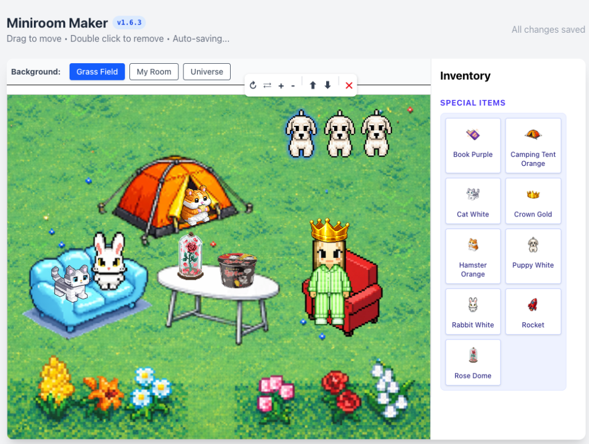

# 🏠 🌰 Miniroom Maker (Dotori World Style)

[](README.ko.md)

A **Drag & Drop Room Decorator** project built with Next.js and TypeScript.
Create your own retro **Dotori World** style miniroom!

🔗 **Live Demo**: [https://miniroom-demo.vercel.app](https://miniroom-demo.vercel.app)




## ✨ Key Features

*   **🖱️ Drag & Drop**: Freely place items from the inventory anywhere in the room.
*   **🎨 Pixel Art Style**: High-quality pixel art furniture (chairs, tables, etc.).
*   **🛠️ Item Transformation**:
    *   **Rotate**: Rotate selected items 90 degrees clockwise.
    *   **Flip**: Flip items horizontally.
    *   **Resize**: Use `+`/`-` buttons in the toolbar to scale items (0.5x ~ 2.0x).
    *   **Layering**: Adjust Z-order with `⬆` (Bring Forward) and `⬇` (Send Backward) buttons.
*   **💾 Management & Auto-Save**:
    *   **Precise Selection**: Selection outlines strictly follow the visible pixels of the item.
    *   **Delete**: Remove items by double-clicking or using the delete button.
    *   **Auto-Save**: Changes are automatically saved in real-time (simulated).

## 🛠️ Tech Stack

*   **Framework**: Next.js 16 (App Router)
*   **Language**: TypeScript
*   **Styling**: Tailwind CSS
*   **Deploy**: Vercel (CI/CD Automated)

## 🚀 Getting Started

Follow these steps to run the project locally.

1.  **Clone the Repository**
    ```bash
    git clone https://github.com/WoojinAhn/miniroom-demo.git
    cd miniroom-demo
    ```

2.  **Install Packages**
    ```bash
    npm install
    ```

3.  **Run Development Server**
    ```bash
    npm run dev
    ```

4.  **Open Browser**
    Visit `http://localhost:3000` to see the app.

## 🎨 Adding New Items

Simply add images to the `public/items/` folder and push. They will be **automatically registered** in the inventory!

1. Add image to `public/items/` (PNG recommended).
2. Use `snake_case` for filenames (e.g., `shin_ramen.png`).
3. Commit & Push.
4. It will appear in the inventory automatically upon build! 🎉

## 🌟 Adding Special Items

Images added to `public/special/` will appear in the **Special Items** section at the top.

1. Add image to `public/special/` (e.g., `rocket.png`).
2. It will be categorized as a 'Special Item' and shown at the top of the inventory.


## 📂 Project Structure

```
src/
├── app/
│   ├── page.tsx               # Main Page (Miniroom)
│   └── miniroom/
│       ├── components/        # UI Components
│       │   ├── RoomCanvas.tsx     # Main Canvas
│       │   ├── DraggableItem.tsx  # Draggable Item Logic
│       │   └── Inventory.tsx      # Inventory List
│       └── hooks/
│           └── useMiniroom.ts     # Core Logic (State, Move, Delete)
├── types/                     # Type Definitions (Room, Item, Transformation)
└── data/                      # Mock Data (Initial Items)
```

## 📝 License

MIT License
